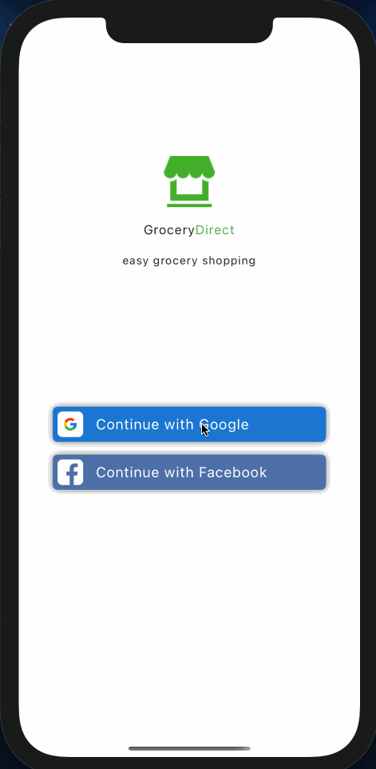

## Installation
root > cd app > npm i

root > cd server > npm i 
(use your own atlas DB_URL and good to go)

## Tech Stack
Built with React-Native (Expo) , MongoDB (Atlas) , Express, React-Native-Design-Utility, React-Navigation, expo-google-app-auth

## User Stories
- [x] Create a Splash Screen and add Animation to it.
- [x] User can Log in using **oAuth**
- [x] Create a **JWT** (JSON Web Token) to create an encryption signature to store private data
- [x] Use **MongoDB Atlas** for handling data for the Customer as well as Addresses.
- [x] **AsyncStorage** is used to store the JWT into the user device's cache to skip sign-in process for returning users
- [x] Google Autocomplete functionality using **Google Places API** to input user provided address data.
- [x] Use **Animations** for deleting items from the shopping cart screen.
- [x] Create basic log out functionality
- [x] Allow updating of shopping cart item quantity from the grocery list and shopping cart
